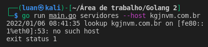

Projeto feito usando Golang com as packages net e urfave/cli. Baseado no curso de Golang do devbook. 

Uma pequena aplicação em linha de comando, que faz a busca por IP e servidor da seguinte forma:

Sendo executado dessa forma no terminal

"go run main.go ip --host dominio.com"

"go run main.go servidores --host dominio.com"

Em caso de domínio inválido, o erro é tratado de acordo: 

